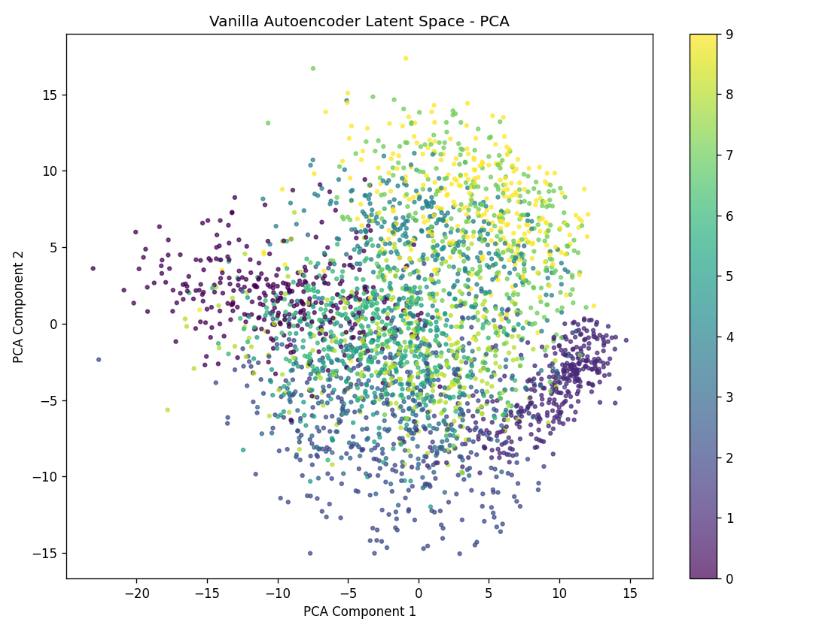

# Autoencoders for Dimensionality Reduction

## MNIST Image Compression and Denoising Using Deep Learning

This project implements and compares multiple **Autoencoder architectures** for dimensionality reduction, image compression, reconstruction, denoising, latent-space visualization, and generative modeling using the **MNIST handwritten digit dataset**.

The project explores four major Autoencoder architectures:

1. **Vanilla Autoencoder**
2. **Convolutional Autoencoder (CAE)**
3. **Denoising Autoencoder**
4. **Variational Autoencoder (VAE)**

The main objective is to study how neural networks can learn compact latent representations of high-dimensional image data while preserving important visual information.

---

## Table of Contents

- [Project Overview](#project-overview)
- [Problem Statement](#problem-statement)
- [Objectives](#objectives)
- [Dataset](#dataset)
- [Project Workflow](#project-workflow)
- [Data Preprocessing](#data-preprocessing)
- [Vanilla Autoencoder](#vanilla-autoencoder)
- [Convolutional Autoencoder](#convolutional-autoencoder)
- [Denoising Autoencoder](#denoising-autoencoder)
- [Variational Autoencoder](#variational-autoencoder)
- [Latent Space Visualization](#latent-space-visualization)
- [Evaluation Metrics](#evaluation-metrics)
- [Generated Visualizations](#generated-visualizations)
- [Generated Files](#generated-files)
- [Model Comparison](#model-comparison)
- [Key Findings](#key-findings)
- [Installation](#installation)
- [How to Run](#how-to-run)
- [Project Structure](#project-structure)
- [Applications](#applications)
- [Limitations](#limitations)
- [Future Improvements](#future-improvements)
- [Conclusion](#conclusion)

---

# Project Overview

Autoencoders are neural networks designed to learn efficient representations of input data.

An Autoencoder contains two main components:

### Encoder

The encoder transforms high-dimensional input data into a smaller latent representation.

```text
Input Image
    |
    v
Encoder
    |
    v
Latent Representation
```

### Decoder

The decoder attempts to reconstruct the original input from the compressed latent representation.

```text
Latent Representation
    |
    v
Decoder
    |
    v
Reconstructed Image
```

The complete architecture can therefore be represented as:

```text
Original Image
      |
      v
   Encoder
      |
      v
Latent Space
      |
      v
   Decoder
      |
      v
Reconstructed Image
```

For MNIST, every image contains:

```text
28 x 28 = 784 pixels
```

The Autoencoders developed in this project compress these 784 pixel values into much smaller latent vectors such as:

- 32 dimensions
- 16 dimensions
- 20 dimensions

---

# Problem Statement

High-dimensional data requires significant storage and computational resources. Many dimensions may also contain redundant or less useful information.

The objective of this project is to implement Autoencoders capable of learning compact representations of MNIST handwritten digit images.

The project investigates whether these compressed representations can:

- reconstruct the original images,
- preserve important visual characteristics,
- reduce dimensionality,
- remove image noise,
- reveal meaningful latent-space structures,
- and generate new handwritten digit samples.

---

# Objectives

The major objectives of this project are:

- Load and preprocess the MNIST dataset.
- Normalize image pixel values between 0 and 1.
- Create Gaussian and Salt-and-Pepper corrupted images.
- Implement a Vanilla Autoencoder.
- Implement a Convolutional Autoencoder.
- Implement a Denoising Autoencoder.
- Implement a Variational Autoencoder.
- Compare reconstruction performance.
- Analyze different latent dimensions.
- Measure reconstruction error.
- Evaluate denoising using PSNR.
- Evaluate image similarity using SSIM.
- Visualize latent representations using PCA.
- Visualize latent representations using t-SNE.
- Examine convolutional feature maps and learned filters.
- Generate new digit samples using a VAE.
- Study interpolation in VAE latent space.
- Compare compression ratio against reconstruction quality.

---

# Dataset

## MNIST Handwritten Digit Dataset

The project uses the **MNIST dataset**, one of the most widely used datasets for image classification and representation learning.

### Dataset Characteristics

| Property | Value |
|---|---|
| Dataset | MNIST |
| Image Type | Grayscale |
| Image Resolution | 28 × 28 |
| Number of Classes | 10 |
| Classes | Digits 0–9 |
| Training Images | 60,000 |
| Testing Images | 10,000 |
| Total Images | 70,000 |
| Original Features | 784 |
| Pixel Range Before Normalization | 0–255 |
| Pixel Range After Normalization | 0–1 |

Each MNIST image represents a handwritten digit from **0 to 9**.

---

# Project Workflow

The overall workflow followed in this project is:

```text
MNIST Dataset
      |
      v
Data Loading
      |
      v
Data Preprocessing
      |
      +--------------------+
      |                    |
      v                    v
Flattened Images      2D CNN Images
784 Features          28 x 28 x 1
      |                    |
      v                    v
Vanilla AE       Convolutional AE
      |                    |
      v                    v
32-D Latent        16-D Latent
      |                    |
      +----------+---------+
                 |
                 v
        Reconstruction
                 |
                 v
        Performance Analysis
                 |
        +--------+--------+
        |                 |
        v                 v
       PCA              t-SNE
        |
        v
Latent Space Analysis
```

A separate denoising pipeline is also implemented:

```text
Clean MNIST Image
       |
       v
Noise Addition
       |
       +----------------+
       |                |
       v                v
Gaussian Noise   Salt-and-Pepper
       |                |
       +-------+--------+
               |
               v
      Denoising Autoencoder
               |
               v
        Denoised Image
               |
               v
          PSNR + SSIM
```

---

# Data Preprocessing

The MNIST images are initially stored using pixel values ranging from:

```text
0 to 255
```

The images are normalized using:

```python
x_train = x_train.astype("float32") / 255.0
x_test = x_test.astype("float32") / 255.0
```

The resulting pixel range becomes:

```text
0.0 to 1.0
```

Two input formats are generated.

### Vanilla Autoencoder Input

The 28 × 28 images are flattened:

```text
28 × 28
   ↓
784
```

Resulting shape:

```text
(60000, 784)
```

### Convolutional Autoencoder Input

The original spatial dimensions are retained:

```text
28 × 28 × 1
```

Resulting shape:

```text
(60000, 28, 28, 1)
```

---

# Noise Generation

The project evaluates Autoencoder performance on corrupted images using two types of noise.

## Gaussian Noise

Gaussian noise is added using:

```text
Noisy Image = Original Image + Noise Factor × Gaussian Noise
```

The default training noise factor is:

```text
0.5
```

The model is additionally evaluated at:

```text
0.3
0.5
0.7
```

This helps analyze how reconstruction performance changes as image corruption increases.

---

## Salt-and-Pepper Noise

Salt-and-Pepper noise randomly converts selected pixels to:

```text
0 → Black
1 → White
```

The Denoising Autoencoder is trained with a mixed-noise dataset containing both Gaussian and Salt-and-Pepper corrupted samples.

This improves the ability of the model to learn more general image restoration features.

---

# Vanilla Autoencoder

The first model is a fully connected **Vanilla Autoencoder**.

## Encoder Architecture

```text
Input
784
 |
 v
Dense 512
ReLU
 |
 v
Dense 256
ReLU
 |
 v
Dense 128
ReLU
 |
 v
Latent Layer
32
```

The encoder compresses:

```text
784 → 32
```

This corresponds to a theoretical compression ratio of:

```text
784 / 32 = 24.5 : 1
```

---

## Decoder Architecture

The decoder reconstructs the original image:

```text
Latent Layer
32
 |
 v
Dense 128
ReLU
 |
 v
Dense 256
ReLU
 |
 v
Dense 512
ReLU
 |
 v
Output
784
Sigmoid
```

The sigmoid activation keeps reconstructed pixel values within:

```text
0 to 1
```

---

# Convolutional Autoencoder

The Convolutional Autoencoder uses convolutional layers to preserve spatial relationships between pixels.

This makes it particularly suitable for image data.

## Encoder Architecture

```text
Input
28 × 28 × 1
      |
      v
Conv2D
32 Filters
Stride 2
      |
      v
14 × 14 × 32
      |
      v
Conv2D
64 Filters
Stride 2
      |
      v
7 × 7 × 64
      |
      v
Conv2D
128 Filters
Stride 2
      |
      v
4 × 4 × 128
      |
      v
Flatten
      |
      v
Dense
16-D Latent Vector
```

The latent representation contains only:

```text
16 features
```

The theoretical dimensional compression ratio relative to the original 784 pixels is:

```text
784 / 16 = 49 : 1
```

---

# Convolutional Decoder

The decoder reconstructs the original image from the 16-dimensional latent representation.

The implemented decoder uses the following shape transformation:

```text
16-D Latent Vector
       |
       v
Dense
4 × 4 × 128
       |
       v
Reshape
4 × 4 × 128
       |
       v
Conv2DTranspose
       |
       v
8 × 8 × 64
       |
       v
Cropping2D
       |
       v
7 × 7 × 64
       |
       v
Conv2DTranspose
       |
       v
14 × 14 × 32
       |
       v
Conv2DTranspose
       |
       v
28 × 28 × 1
```

The final layer uses a sigmoid activation function.

Final output shape:

```text
28 × 28 × 1
```

This matches the original MNIST image dimensions.

---

# Denoising Autoencoder

A **Denoising Autoencoder** is trained to reconstruct clean images from corrupted versions.

Instead of learning:

```text
Clean Image → Clean Image
```

the model learns:

```text
Noisy Image → Clean Image
```

The training dataset contains both:

- Gaussian noise
- Salt-and-Pepper noise

The model therefore learns to recognize important digit structures while suppressing random image corruption.

---

# Denoising Pipeline

```text
Original Image
      |
      v
Noise Addition
      |
      v
Noisy Image
      |
      v
Denoising Autoencoder
      |
      v
Denoised Image
      |
      v
Compare with Original
      |
      +----------+
      |          |
      v          v
     PSNR       SSIM
```

---

# Variational Autoencoder

The project additionally implements a **Variational Autoencoder (VAE)**.

Unlike a standard Autoencoder, the VAE learns a probability distribution in latent space.

The encoder generates:

```text
Mean
μ
```

and:

```text
Log Variance
log(σ²)
```

A latent vector is sampled using the reparameterization trick:

```text
z = μ + σ × ε
```

where:

```text
ε ~ N(0, 1)
```

---

# VAE Loss

The VAE objective contains two components.

## Reconstruction Loss

Measures the difference between the original and reconstructed images.

## KL Divergence

Encourages the latent distribution to remain close to a standard normal distribution.

The total loss is:

```text
Total Loss =
Reconstruction Loss
+
β × KL Divergence
```

The implementation uses:

```text
β = 1.0
```

---

# Latent Space Visualization

One of the major objectives of the project is understanding the representations learned by the Autoencoder.

The Vanilla Autoencoder compresses every MNIST image into a:

```text
32-dimensional vector
```

Since 32 dimensions cannot be directly visualized, **Principal Component Analysis (PCA)** is used to project these representations into two dimensions.

## Vanilla Autoencoder Latent Space Using PCA



**Figure:** PCA visualization of the 32-dimensional latent representations learned by the Vanilla Autoencoder.

Each point represents one MNIST image.

The position of each point is determined by the compressed representation generated by the encoder, while the digit class is used to distinguish the samples.

The visualization helps examine whether the Autoencoder learns meaningful structural relationships between handwritten digits without directly using class labels during Autoencoder training.

Digits with similar visual structures may appear closer together, while visually different digits can form more separated regions.

---

# PCA

**Principal Component Analysis (PCA)** is a dimensionality-reduction technique that transforms high-dimensional data into a smaller number of components while attempting to preserve as much variance as possible.

In this project:

```text
32-D Latent Representation
          |
          v
         PCA
          |
          v
2-D Representation
```

PCA provides a fast and interpretable method for examining the learned latent space.

---

# t-SNE

The project also applies **t-Distributed Stochastic Neighbor Embedding (t-SNE)**.

```text
32-D Latent Representation
          |
          v
        t-SNE
          |
          v
2-D Visualization
```

t-SNE focuses on preserving local neighborhood relationships and can reveal clusters in nonlinear high-dimensional data.

The combination of PCA and t-SNE provides complementary views of the learned latent representations.

---

# Evaluation Metrics

Several metrics are used to evaluate model performance.

## Mean Squared Error

Reconstruction quality is evaluated using **Mean Squared Error (MSE)**.

```text
MSE = Mean((Original - Reconstructed)²)
```

A smaller MSE indicates that the reconstructed image is closer to the original image.

---

# Peak Signal-to-Noise Ratio

Denoising quality is evaluated using **Peak Signal-to-Noise Ratio (PSNR)**.

PSNR is expressed in decibels:

```text
PSNR (dB)
```

The project compares:

```text
Original vs Noisy
```

and:

```text
Original vs Denoised
```

The improvement is calculated as:

```text
PSNR Improvement
=
Denoised PSNR - Noisy PSNR
```

A higher PSNR generally indicates better reconstruction quality.

---

# Structural Similarity Index

The **Structural Similarity Index Measure (SSIM)** evaluates structural similarity between two images.

SSIM considers characteristics such as:

- luminance,
- contrast,
- structural information.

Values closer to:

```text
1.0
```

indicate greater structural similarity.

The project compares:

```text
Noisy SSIM
```

against:

```text
Denoised SSIM
```

to evaluate the effectiveness of the Denoising Autoencoder.

---

# Generated Visualizations

The project automatically generates and saves multiple visualizations.

| File | Description |
|---|---|
| `01_mnist_samples.png` | Sample MNIST handwritten digits |
| `02_original_vs_noisy.png` | Original and Gaussian-corrupted images |
| `03_vanilla_training_loss.png` | Vanilla Autoencoder training and validation loss |
| `04_vanilla_reconstruction_grid.png` | Vanilla original vs reconstructed images |
| `05_vanilla_error_by_digit.png` | Reconstruction MSE for each digit |
| `06_reconstruction_error_heatmap.png` | Digit-wise reconstruction error heatmap |
| `07_vanilla_latent_pca.png` | PCA visualization of Vanilla latent space |
| `08_vanilla_latent_tsne.png` | t-SNE visualization of Vanilla latent space |
| `09_conv_training_loss.png` | Convolutional Autoencoder training loss |
| `10_conv_reconstruction_grid.png` | CNN reconstruction results |
| `11_learned_conv_filters.png` | Learned filters from first convolution layer |
| `12_conv_latent_pca.png` | PCA of Convolutional Autoencoder latent space |
| `13_encoder_feature_maps.png` | Feature maps extracted by CNN encoder |
| `14_denoising_training_loss.png` | Denoising Autoencoder training loss |
| `15_denoising_results.png` | Noisy, denoised and original image comparison |
| `16_psnr_comparison.png` | PSNR comparison across Gaussian noise levels |
| `17_ssim_comparison.png` | SSIM comparison across Gaussian noise levels |
| `18_noise_level_denoising.png` | Denoising at noise factors 0.3, 0.5 and 0.7 |
| `19_salt_pepper_denoising.png` | Salt-and-Pepper denoising results |
| `20_vanilla_vs_conv_reconstruction.png` | Vanilla vs CNN reconstruction comparison |
| `21_vae_training_loss.png` | VAE training loss |
| `22_vae_latent_space.png` | PCA visualization of VAE latent space |
| `23_vae_generated_samples.png` | New images generated using VAE |
| `24_vae_latent_interpolation.png` | Interpolation between two latent representations |
| `25_vae_digit_manifold.png` | VAE latent-space digit manifold |
| `26_compression_vs_quality.png` | Compression ratio vs reconstruction error |
| `27_model_loss_comparison.png` | Reconstruction error comparison between models |

---

# Generated Files

In addition to visualization files, the project saves trained model weights, histories, configuration files and evaluation results.

## Model Weight Files

```text
vanilla_autoencoder.weights.h5
vanilla_encoder.weights.h5

convolutional_autoencoder.weights.h5
convolutional_encoder.weights.h5

denoising_autoencoder.weights.h5

vae_encoder.weights.h5
vae_decoder.weights.h5
```

---

## Training Histories

```text
vanilla_history.pkl
conv_history.pkl
denoising_history.pkl
vae_history.pkl
```

These files contain training information that can be loaded later for analysis.

---

## Configuration Files

```text
project_config.json
project_config.yaml
```

These files store important project settings such as:

- batch size,
- learning rate,
- latent dimensions,
- number of epochs,
- noise factor,
- VAE beta value.

---

## Evaluation Files

```text
vanilla_reconstruction_error_by_digit.csv
denoising_metrics.csv
compression_quality_comparison.csv
model_reconstruction_comparison.csv
comparative_analysis_table.csv
final_metrics.json
final_metrics.yaml
file_inventory.csv
project_summary.txt
```

---

# Model Comparison

The project compares the major models using the following structure:

| Model | Latent Dimension | Primary Objective | Best Use Case |
|---|---:|---|---|
| Vanilla Autoencoder | 32 | Dimensionality reduction | Basic image compression |
| Convolutional Autoencoder | 16 | Spatial feature compression | Image compression |
| Denoising Autoencoder | 16 | Noise removal | Image restoration |
| Variational Autoencoder | 20 | Probabilistic representation | Generative modeling |

Actual reconstruction losses and training times are generated automatically during execution and stored in:

```text
comparative_analysis_table.csv
```

This avoids hard-coding experimental results before the models are trained.

---

# Compression Analysis

The original MNIST image contains:

```text
784 features
```

## Vanilla Autoencoder

```text
Original = 784
Latent = 32

Compression Ratio
= 784 / 32
= 24.5 : 1
```

## Convolutional Autoencoder

```text
Original = 784
Latent = 16

Compression Ratio
= 784 / 16
= 49 : 1
```

## Variational Autoencoder

```text
Original = 784
Latent = 20

Compression Ratio
= 784 / 20
= 39.2 : 1
```

These ratios describe the dimensional reduction from the original pixel representation to the latent vector. They should not be interpreted directly as file-compression ratios because model parameters and numerical storage formats also affect real storage requirements.

---

# Key Findings

### 1. Autoencoders Can Perform Nonlinear Dimensionality Reduction

The Vanilla Autoencoder reduces each MNIST image from:

```text
784 dimensions
```

to:

```text
32 dimensions
```

while learning a representation that can be decoded back into an approximation of the original image.

---

### 2. Convolutional Layers Preserve Spatial Information

Fully connected layers treat images as flattened vectors.

Convolutional layers instead process local spatial patterns such as:

- edges,
- curves,
- strokes,
- corners,
- digit structures.

This makes Convolutional Autoencoders particularly appropriate for image data.

---

### 3. Strong Compression Is Possible

The Convolutional Autoencoder uses a latent representation of only:

```text
16 dimensions
```

compared with the original:

```text
784 dimensions
```

This demonstrates substantial dimensionality reduction.

---

### 4. Latent Representations Contain Meaningful Structure

The PCA visualization:

```text
07_vanilla_latent_pca.png
```

demonstrates how the learned 32-dimensional latent vectors can be projected into a two-dimensional space for analysis.

The appearance of structure or clustering indicates that the Autoencoder is learning relationships between digit images rather than simply storing raw pixels.

---

### 5. Autoencoders Can Remove Noise

The Denoising Autoencoder learns:

```text
Corrupted Image
      ↓
Clean Reconstruction
```

This demonstrates that Autoencoders can learn robust features that are less sensitive to random pixel corruption.

---

### 6. Noise Level Affects Reconstruction

The project evaluates Gaussian noise factors:

```text
0.3
0.5
0.7
```

Increasing noise removes more information from the original image and generally makes accurate reconstruction more difficult.

---

### 7. PSNR and SSIM Provide Complementary Evaluation

MSE measures pixel-level reconstruction error.

PSNR provides a signal-quality measurement.

SSIM evaluates structural similarity.

Using all three gives a more complete picture of reconstruction and denoising quality.

---

### 8. VAEs Learn a Generative Latent Space

The Variational Autoencoder differs from conventional Autoencoders because its latent space is probabilistic.

This enables operations such as:

- random sampling,
- new digit generation,
- latent interpolation,
- latent manifold visualization.

---

# Training Configuration

The main training configuration is:

```text
Optimizer       : Adam
Learning Rate   : 0.001
Batch Size      : 256
Maximum Epochs  : 50
Validation Split: 10%
Loss            : Mean Squared Error
Random Seed     : 42
```

The project also uses:

```text
EarlyStopping
ReduceLROnPlateau
```

to improve training efficiency.

Early stopping prevents unnecessary epochs when validation performance stops improving.

---

# Technologies Used

The project is implemented using:

- Python
- TensorFlow
- Keras
- NumPy
- Pandas
- Matplotlib
- Scikit-learn
- Scikit-image
- PyYAML

---

# Installation

Install the required Python packages using:

```bash
pip install tensorflow numpy pandas matplotlib scikit-learn scikit-image pyyaml requests
```

If Jupyter Notebook is required:

```bash
pip install notebook
```

Start Jupyter using:

```bash
jupyter notebook
```

---

# How to Run

## Step 1: Create the Project Directory

The project uses:

```text
C:\Users\sagni\Downloads\Autoencoders for Dimensionality Reduction
```

The Python code automatically creates the directory if it does not already exist.

---

## Step 2: Install Dependencies

Run:

```bash
pip install tensorflow numpy pandas matplotlib scikit-learn scikit-image pyyaml requests
```

---

## Step 3: Run the Python Code

Execute the project notebook or Python script.

The program will automatically:

1. Load MNIST.
2. Normalize the dataset.
3. Generate noisy images.
4. Train the Vanilla Autoencoder.
5. Evaluate reconstruction quality.
6. Generate PCA and t-SNE latent visualizations.
7. Train the Convolutional Autoencoder.
8. Visualize CNN filters and feature maps.
9. Train the Denoising Autoencoder.
10. Evaluate Gaussian noise.
11. Evaluate Salt-and-Pepper noise.
12. Calculate PSNR.
13. Calculate SSIM.
14. Train the Variational Autoencoder.
15. Generate new VAE samples.
16. Perform latent interpolation.
17. Generate the latent manifold.
18. Compare compression and reconstruction performance.
19. Save model weights and training histories.
20. Save all graphs and CSV results.
21. Generate a submission folder.
22. Create a compressed ZIP archive.

---

# MNIST Download Handling

The implementation contains a robust MNIST loading system.

It attempts to obtain the dataset using multiple methods:

```text
1. Existing mnist.npz in project directory
2. Existing Keras dataset cache
3. Standard Keras MNIST loader
4. Direct download using requests
5. Direct download using urllib
```

Once available, the dataset is saved as:

```text
mnist.npz
```

inside the project directory.

This reduces the need to download MNIST repeatedly.

---

# Project Structure

```text
Autoencoders for Dimensionality Reduction/
│
├── mnist.npz
│
├── project_config.json
├── project_config.yaml
│
├── vanilla_autoencoder.weights.h5
├── vanilla_encoder.weights.h5
├── vanilla_history.pkl
│
├── convolutional_autoencoder.weights.h5
├── convolutional_encoder.weights.h5
├── conv_history.pkl
│
├── denoising_autoencoder.weights.h5
├── denoising_history.pkl
│
├── vae_encoder.weights.h5
├── vae_decoder.weights.h5
├── vae_history.pkl
│
├── vanilla_reconstruction_error_by_digit.csv
├── denoising_metrics.csv
├── compression_quality_comparison.csv
├── model_reconstruction_comparison.csv
├── comparative_analysis_table.csv
├── final_metrics.json
├── final_metrics.yaml
├── file_inventory.csv
├── project_summary.txt
│
├── 01_mnist_samples.png
├── 02_original_vs_noisy.png
├── 03_vanilla_training_loss.png
├── 04_vanilla_reconstruction_grid.png
├── 05_vanilla_error_by_digit.png
├── 06_reconstruction_error_heatmap.png
├── 07_vanilla_latent_pca.png
├── 08_vanilla_latent_tsne.png
├── 09_conv_training_loss.png
├── 10_conv_reconstruction_grid.png
├── 11_learned_conv_filters.png
├── 12_conv_latent_pca.png
├── 13_encoder_feature_maps.png
├── 14_denoising_training_loss.png
├── 15_denoising_results.png
├── 16_psnr_comparison.png
├── 17_ssim_comparison.png
├── 18_noise_level_denoising.png
├── 19_salt_pepper_denoising.png
├── 20_vanilla_vs_conv_reconstruction.png
├── 21_vae_training_loss.png
├── 22_vae_latent_space.png
├── 23_vae_generated_samples.png
├── 24_vae_latent_interpolation.png
├── 25_vae_digit_manifold.png
├── 26_compression_vs_quality.png
├── 27_model_loss_comparison.png
│
└── submission_files/
```

---

# Applications

Autoencoders have applications in many areas of machine learning and computer vision.

### Dimensionality Reduction

Autoencoders can transform high-dimensional datasets into compact feature representations.

### Image Compression

Images can be represented using smaller latent vectors.

### Image Denoising

Denoising Autoencoders can reconstruct clean images from corrupted inputs.

### Feature Learning

Latent vectors can be used as features for downstream machine-learning models.

### Anomaly Detection

Autoencoders trained on normal samples often produce larger reconstruction errors for unusual inputs.

### Generative Modeling

Variational Autoencoders can sample from learned latent distributions to generate new data.

### Representation Learning

Autoencoders can discover useful representations without requiring class labels during reconstruction training.

---

# Limitations

Although the project demonstrates several Autoencoder applications, some limitations remain.

### Dataset Complexity

MNIST contains small grayscale handwritten digits and is considerably simpler than real-world image datasets.

### Reconstruction Blur

Autoencoders, particularly VAEs, can sometimes produce smoother or blurrier reconstructions.

### Latent Dimension Selection

There is no universally optimal latent dimension.

A very small latent space may lose important information, while a large latent space may provide weaker compression.

### Noise Generalization

A Denoising Autoencoder performs best on noise distributions similar to those represented during training.

Real-world image corruption can be significantly more complex than synthetic Gaussian or Salt-and-Pepper noise.

### Computational Requirements

Training multiple neural networks, especially convolutional and variational models, can require significant computational time on CPU-only systems.

---

# Future Improvements

The project can be extended in several ways.

## 1. Beta-VAE Experiments

Future experiments can compare:

```text
β = 0.5
β = 1.0
β = 2.0
```

to study the trade-off between reconstruction quality and latent-space regularization.

---

## 2. Larger Datasets

The architectures can be tested on:

```text
Fashion-MNIST
CIFAR-10
CelebA
```

to evaluate performance on more complex images.

---

## 3. Deeper Autoencoders

Additional convolutional layers and residual connections could improve feature extraction.

---

## 4. Sparse Autoencoders

Sparsity constraints could encourage the model to learn more selective representations.

---

## 5. Classification Using Latent Features

The learned latent vectors could be used as input to a classifier.

For example:

```text
MNIST Image
     |
     v
Autoencoder Encoder
     |
     v
Latent Features
     |
     v
Classifier
     |
     v
Digit Prediction
```

This would help evaluate whether compressed representations retain enough information for downstream classification.

---

## 6. Anomaly Detection

The model could be trained on selected digit classes and tested against unseen classes.

Higher reconstruction errors could then be investigated as an anomaly signal.

---

## 7. Additional Image Quality Metrics

Future versions could include:

- MAE
- RMSE
- normalized MSE
- perceptual similarity metrics

for more comprehensive evaluation.

---

# Conclusion

This project demonstrates the effectiveness of **Autoencoders for dimensionality reduction, image compression, reconstruction, denoising, representation learning, and generative modeling**.

The Vanilla Autoencoder provides a simple fully connected approach that compresses the original **784-dimensional MNIST images into 32-dimensional latent vectors**.

The Convolutional Autoencoder extends this idea by preserving spatial image relationships and compressing each image into a **16-dimensional latent representation**.

The Denoising Autoencoder demonstrates how learned representations can be used to recover cleaner digit images from both **Gaussian and Salt-and-Pepper noise**. Its effectiveness is evaluated using reconstruction error, **PSNR**, and **SSIM**.

The Variational Autoencoder introduces a probabilistic latent representation that supports **digit generation, latent interpolation, and manifold exploration**.

The PCA visualization stored in:

```text
07_vanilla_latent_pca.png
```

provides an interpretable view of the structure learned by the Vanilla Autoencoder in its compressed representation.

Overall, the project demonstrates that Autoencoders are powerful unsupervised deep-learning models capable of learning compact and useful representations of image data while supporting applications ranging from compression and denoising to visualization and generation.

---

## Main Visualization


---

## Project

**Autoencoders for Dimensionality Reduction**

**Dataset:** MNIST Handwritten Digits

**Domain:** Deep Learning / Computer Vision

**Techniques:** Autoencoders, Convolutional Neural Networks, Denoising Autoencoders, Variational Autoencoders, PCA, t-SNE, PSNR, SSIM
